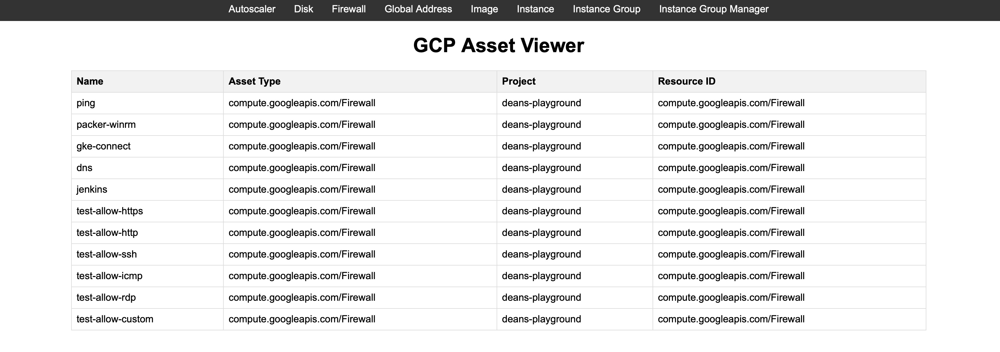

# GCP Asset Viewer

A simple web app in Go and HTMX that retrives all the assets in a GCP project



## Usage/Examples

The project name is currently hardcoded in 2 places:

```go
    searchRequest := &assetpb.SearchAllResourcesRequest{
        Scope: "projects/<your_project>",
    }
```

```go
     resource := Resource {
            Name:       name,
            AssetType:  resourceResponse.AssetType,
            Project:    "<your-project>",
            ResourceID: resourceResponse.AssetType,
        }
```

## Todos

- Will add more resources as time goes on.
- The frontend could use a little bit more styling.
- Will add more authentication options to GCP.

## Optimizations

- Currenly everything is being retrieved through the assets inventory API, which responds with all the assets in the project (can also be an organization) in a one, huge JSON. Every click on a different resource is making a new request to the assets API, which is slow.
